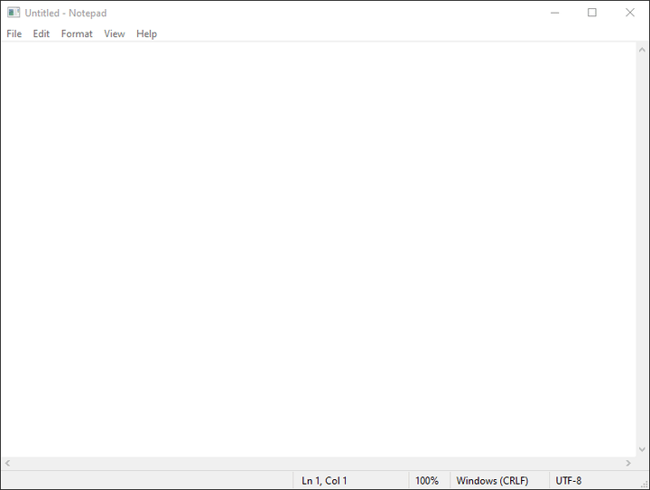

# Foxhound

Foxhound is a standalone Windows window primitive: `foxhound-window` resolves
a process, title, or HWND into a stable main-window stage plus its owned
dialogs/popups, while `foxhound-capture` and `foxhound-input` provide the
capture and input adapters. A System 1 harness such as AgentPC or TASR can
use it as a dependency, but Foxhound does not depend on either harness.

<div align="right"><strong>agent no swiping</strong></div>


Unfocused Windows capture and input injection for apps that must run without
stealing the user's keyboard, cursor, foreground window, or visual z-order. A
helper-lifetime background lease catches delayed dialogs and popups; if a target
self-activates, Foxhound restores the last foreground window that belonged to
the user.

Foxhound is a Rust library/SDK with an optional localhost HTTP helper. It is
not a UI, agent runtime, mission system, recorder, or clip tool.

The current backend is Windows/Win32. The crate boundaries are intentionally
platform-neutral: Linux and macOS build with explicit stubs that point to the
backend surfaces to implement. The primitive remains the same on every
platform—discover a target, capture it without foreground focus, and inject
input without taking the user's keyboard—while the native window APIs differ.



The demo shows a System 1 computer-use harness writing into an unfocused
Notepad window. The user keeps their keyboard focus the whole time.

Foxhound is useful beneath harnesses such as AgentPC and TASR, but it has no
dependency on either product.

Workspace crates:

- `foxhound-capture` — composited snapshots of covered native windows
- `foxhound-input` — posted pointer, key-chord, and Unicode text injection
- `foxhound-helper` — HTTP adapter for clients such as TASR

```powershell
cargo test --workspace
cargo run -p foxhound-helper -- --process notepad.exe
```
